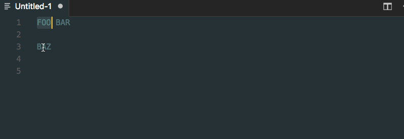
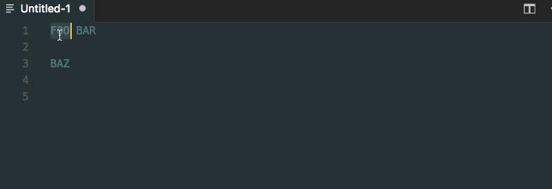

# vscode-lowercase
Convert selection to lowercase in [Visual Studio Code](https://github.com/Microsoft/vscode).

[](http://standardjs.com/)
[](https://travis-ci.org/ruiquelhas/vscode-lowercase)
[](https://codecov.io/gh/ruiquelhas/vscode-lowercase)

## How it works

### Using the command palette


### Using a keyboard shortcut


The default keboard shortcut is set to `alt+shift+l`, but you can change it to something else by overriding the `key` value of the `lowercase.tolowercase` command.

## Contributing
Contributions are welcome, either via [issues](https://github.com/ruiquelhas/vscode-lowercase/issues/new) or [pull requests](https://github.com/ruiquelhas/vscode-lowercase/compare).

For any code addition or change, follow the [style guide](http://standardjs.com/rules.html), add the respective tests and make sure the existing ones still pass.

### Running the tests

```sh
$ npm t
```

## License
MIT
